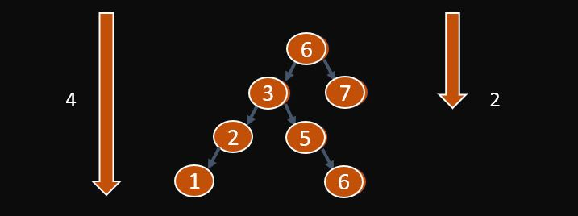

## Description

An AVL is a BST (Binary Search Tree) that balances itself. Such a tree is mainly used for archiving functionalities when data retrieval is prioritized over data manipulation. The worst case it will consume is **O(log n)** as it constantly rebalances itself; compared to a BST which will take O(n), assuming that you insert the items incrementally (e.g. 1 -> 2 -> 3 -> 4 …).
\
\
In this blog, I will be coding a C++ console application that demonstrates how an AVL tree balances itself and display the different traversals step by step to understand how the AVL tree works.

## Functionalities
1. Adding a node to the tree.
2. Removing a node from the tree.
3. Displaying path of a value in the tree.
4. Displaying values in an ascending order.
5. Displaying the value of the node given a position using level-by-level traversal.
6. (Bonus) Displaying the tree in a 2D format in the console!
The full source code can be found here.
\
\
<a href="https://gist.github.com/rickkoh/e286114ef189cca283ab20d696d65f66">https://gist.github.com/rickkoh/e286114ef189cca283ab20d696d65f66</a>
\
\
Alternatively you can live demo it here.
\
\
<a href="https://onlinegdb.com/dQycYdSxb">https://onlinegdb.com/dQycYdSxb</a>

## Starting with Rotations
### Balanced or unbalanced
> Not all BST are AVL but all AVL are BST. The difference is that an **AVL is a balanced BST** while a BST can be either balanced or unbalanced.

To determine if the BST is balanced, we check whether the **balance factor** is more than 1 or less than -1, where the balance factor is = height of the left subtree - height of the right subtree.
\
\

To calculate the height of the tree, we use a recursion function to iterate through each layer of the tree. The base case is if the node is NULL which indicates that it has reached the bottom of the tree.
```cpp
int balanceFactor(BinaryNode* t)
{
    if (t != NULL)
        return getHeight(t->left) - getHeight(t->right);
    else
        return 0;
}

int getHeight()
{
    return getHeight(root);
}
int getHeight(BinaryNode* t)
{
    if (t == NULL)
        return 0;
    else
    {
        int leftHeight = getHeight(t->left);
        int rightHeight = getHeight(t->right);
        if (leftHeight > rightHeight)
            return leftHeight + 1;
        else
            return rightHeight + 1;
    }
}
```
### The 4 different rotations
**Left Rotation** Starting with the Left Rotation. This rotation is required when the right subtree is heavier than the left subtree. To execute the Left Rotation, it moves every node from the right to the left.
```cpp
1                    2
  \                /   \
    2      =>    1       3
      \
        3

BinaryNode* rotateLeft(BinaryNode* &t)
{
    BinaryNode* tempNode = t->right;
    t->right = tempNode->left;
    tempNode->left = t;
    return tempNode;
}
```
**Right Rotation** The second type of rotation is the Right Rotation. This rotation is similar to the Left Rotation but is required when the left subtree is heavier than the right subtree. To execute the Right Rotation, it moves every node from the left to the right.
```cpp
        3            2
      /            /   \
    2      =>    1       3
  /    
1        

BinaryNode* rotateRight(BinaryNode* &t)
{
    BinaryNode* tempNode = t->left;
    t->left = tempNode->right;
    tempNode->right = t;
    return tempNode;
}
```
**Left Right Rotation** The third type of rotation is the Left Right Rotation. This rotation will occur when the left node is heavier than the right node with the addition that left node's right subtree is heavier than left node's left subtree. To execute the Left Right Rotation, it will perform a Left Rotation and followed by a Right Rotation.
```cpp
      5                       3
    /   \                   /   \
  2       6      =>       2       5
 /  \                   /        /  \    
1     3               1        4      6     
        \                              
          4                              

BinaryNode* rotateLeftRight(BinaryNode* &t)
{
    BinaryNode* tempNode = t->left;
    t->left = rotateLeft(tempNode);
    return rotateRight(t);
}
```
**Right Left Rotation** The last type of rotation is the Right Left Rotation. This rotation will occur when the right node is heavier than the left node with the addition that the right node's left subtree is heavier than the right node's right subtree. To execute the Right Left Rotation, it will perform a Right Rotation followed by a Left Rotation.
```cpp
     2                       4
   /   \                   /   \
 1       5      =>       2       5
        / \            /   \       \
      4     6        1       3       6
     /       
    3         

BinaryNode* rotateRightLeft(BinaryNode* &t)
{
    BinaryNode* tempNode = t->right;
    t->right = rotateRight(tempNode);
    return rotateLeft(t);
}
```
### Balance
To recap the different cases for each rotation
\
\
**Right heavy** = Left Rotation (L)
\
\
**Left heavy** = Right Rotation (R)
\
\
**Left heavy with a heavier right subtree** = Left Right Rotation (LR)
\
\
**Right heavy with a heavier left subtree** = Right Left Rotation (RL)
```cpp
BinaryNode* balance(BinaryNode* &t)
{
    if (root == NULL)
        return NULL;
    else if (balanceFactor(t) == 2)              // left heavy
    {
        if (balanceFactor(t->left) <= -1)        // right subtree heavier
        {
            cout << "Left Right Rotated" << endl;
            t = rotateLeftRight(t);
        }
        else
        {
            cout << "Right Rotated" << endl;
            t = rotateRight(t);
        }
    }
    else if (balanceFactor(t) == -2)             // right heavy
    {
        if (balanceFactor(t->right) >= 1)        // left subtree heavier
        {
            cout << "Right Left Rotated" << endl;
            t = rotateRightLeft(t);
        }
        else
        {
            cout << "Left Rotated" << endl;
            t = rotateLeft(t);
        }
    }
    return NULL;
}
```
## Insertion
The insertion function will be using recursion as the tree has to trace back and balance itself upon insertion. The base case for this function is (1) if the node is NULL or (2) if the item is found. If the node is NULL, that means that the item does not exist within the tree, hence we will create a new node with the new value and replace the NULL node with the new node. If the node is found, it will print “Item already exists”.
\
\
For the recursion, it will traverse down the tree either to the left (item smaller than node’s item) or to the right (item larger than node’s item) until it reaches the base case. Once it is at the base case, it will trace back and balance the tree.
```cpp
void insert(ItemType item)
{
    insert(root, item);
}
void insert(BinaryNode* &t, ItemType item)
{
    if (t == NULL)
    {
        BinaryNode *newNode = new BinaryNode;
        newNode->item = item;
        newNode->left = NULL;
        newNode->right = NULL;
        t = newNode;
        cout << "Item added successfully." << endl;
    }
    else
        if (item < t->item)
            insert(t->left, item);
        else if (item > t->item)
            insert(t->right, item);
        else
            cout << "Item already exists." << endl;
    balance(t);
}
```
The code optimization for this function is O(logN), as every time it traverses, the number of items it needs to compare is divided by half.
## Deletion
The deletion function will be using recursion as the tree has trace back and balance itself upon deletion. The base case for this function is (1) if the target node is found or (2) if the target node cannot be found.
\
\
**Case 1 (node doesn’t exist)**
If the node does not exist, we will print “Item does not exist.”.
\
\
**Case 2 (no children)**
We can identify whether it has any children by checking if the left and right of the current node is NULL. Once identified, we will set the parent left or right node to NULL with respect to whether it is a left or right child. Else if the node is root, we will set the root to NULL directly.
\
\
**Case 3 (one child)**
We can identify whether it only has one child by checking if one of its children is NULL. Once identified, we will set the parent’s right or left node to its child node respectively.
\
\
**Case 4 (two children)**
The third case is if the node has two children. To do that, we will need to find a successor to replace the current node. The successor will be the next biggest value closest to the current node. Once the successor has been found, we will replace the value of the current node with the successor’s value and then delete the original successor node.
\
\
**Case 5 (hasn’t reached the bottom)**
If we haven’t reached the bottom, we will continue to traverse down the tree by iterating the function. The bottom can be identified if the node is == NULL, as that means that there are more nodes to compare.
```cpp
void remove(ItemType target)
{
    remove(root, target, NULL, false);
}
void remove(BinaryNode* &t, ItemType target, BinaryNode* parent, bool isLeftChild)
{
    if (t == NULL)                                      // base case
    {
        cout << "Item does not exist." << endl;
    }
    else if (target == t-> item) {
        if (t->left == NULL && t->right == NULL) {      // its a leaf
            if (t == root)
                root = NULL;
            else
                if (isLeftChild)
                    parent->left = NULL;
                else
                    parent->right = NULL;
        }
        else if (t->left == NULL) {                     // has right leaf
            if (t == root)
                t = t->right;
            else if (isLeftChild)
                parent->left = t->right;
            else
                parent->right = t->right;
        }
        else if (t->right == NULL) {                    // has left leaf
            cout << isLeftChild << endl;
            if (t == root)
                t = t->left;
            else if (isLeftChild)
                parent->left = t->left;
            else
                parent->right = t->left;
        }
        else {                                          // has two leafs
            BinaryNode* temp = t;
            BinaryNode* successor = t->left;
            while (successor->right != NULL)
                successor = successor->right;
            int n = successor->item;
            remove(t, n, NULL, true);
            temp->item = n;
        }
        cout << "Item removed successfully." << endl;
    }
    else {
        if (target < t->item) {
            remove(t->left, target, t, true);
        } else {
            remove(t->right, target, t, false);
        }
    }
    balance(t);
}
```
## Display path of a value in the tree

This function will be using recursion as well as we will be traversing down the tree layer by layer to search for the value.

The base case of this function will be (1) if the item is found or (2) if we reached the bottom of the tree. If not, we will continue to traverse down the tree by comparing  if the value we are searching for is greater or lesser than the current node’s value.
```cpp
string displayPathOfValue(ItemType target)
{
    string route;
    route = "Root ";
    return displayPathOfValue(root, target, route);
}
string displayPathOfValue(BinaryNode* t, ItemType target, string route)
{
    if (t == NULL)
        return route + "not found";
    else if (t->item == target)
        return route + to_string(t->item) + " found";
    else {
        if (target < t->item)
        {
            route += to_string(t->item) + " L ";
            return displayPathOfValue(t->left, target, route);
        }
        else
        { 
            route += to_string(t->item) + " R ";
            return displayPathOfValue(t->right, target, route);
        }
    }
}
```
## Displaying values in an ascending order
To display the values in an ascending order, we will want to display the values starting from the bottom left, followed by its immediate parent, and then repeat from the left to the right until all the values are displayed.

There will be no base case for this function as it is tail recursive. The condition to stop the function is if the node it checks is NULL.
```cpp
void displayInAscending() {
    if (isEmpty())
        cout << "No item found" << endl;
    else
        displayInAscending(root);
}
void displayInAscending(BinaryNode* t) {
    if (t != NULL) {
        displayInAscending(t->left);
        cout << t->item << endl;
        displayInAscending(t->right);
    }
}
```
## Displaying the value of the node given a position using level-by-level traversal
For this function we will leverage on <a href="https://www.geeksforgeeks.org/queue-data-structure/">Queue</a> to traverse thorugh the nodes level by level, starting from the top (root), and then traverse down layer by layer, from the left to the right using the FIFO method. The position, otherwise known as counter, will decrease by 1 for each traversal we take, hence finding the value of the node given a position.
\
\
The base case will be (1) if the node is null, that means we have traversed through their entire tree and the counter hasn’t finished counting, or (2) if the counter reaches 0, which means we have found the position we are looking for, hence we return the value.
\
\
After checking each value, we will enqueue the left and right node respectively and then dequeue the front node after traversing it.
```cpp
int getValueofPosition(int counter)
{
    Queue q;
    q.enqueue(root);
    return getValueofPosition(q, counter-1);
}
int getValueofPosition(Queue q, int counter)
{
    BinaryNode* parent = q.getFront();
    if (parent == NULL)
    {
        return 0;
    }
    if (counter == 0)
        return parent->item;
    else
    {
        if (parent->left != NULL)
            q.enqueue(parent->left);
        if (parent->right != NULL)
            q.enqueue(parent->right);
        q.dequeue();
        counter--;
        return getValueofPosition(q, counter);
    }
}
```

## Displaying the tree in a 2D format
To print the tree in a 2D format, we need to determine the amount of space required to print on the left and right side of the node.


From the image, we can see that the amount of space we require to print is divided by half every time we travel down the tree. If we reverse it, the number of spaces we require to print everytime we travel up would double.

Hence, we can derive that the amount of space required = 2 ^ height-1.
We minus 1 from the height as we want to start our count from 0.

For example,
\
\
Height = 1, Spaces = 2 ^ (1-1) = 1
\
\
Height = 2, Spaces = 2 ^ (2-1) = 2
\
\
Height = 3, Spaces = 2 ^ (3-1) = 4
\
\
Height = 4, Spaces = 2 ^ (4-1) = 8

Additionally, some digits would require more space. For example any number that comprises 2 digits (such as ‘14’) would require 2 spaces while single digit numbers (such as ‘3’) would require only 1 space. To overcome this, we can determine the number of spaces to push back using the formula log10(x), where x is = value of digit.

log10(1) = 0
\
\
log10(10) = 1
\
\
log10(100) = 2

To print the tree, we will print from the top to the bottom. To print each layer, we will use a for loop and determine the amount of space and parse that value to the next function which will print the level.
\
\
**Base case** If we have reached the target level, we will print the values followed by the number of spaces
\
\
**If not** We will parse the value and iterate to the next level
```cpp
void printTree()
{
    // print level by level
    for (int level = 0; level < getHeight(root); level++)
    {
        printLevel(level);
        cout << endl;
    }
}
void printLevel(int target)
{
    BinaryNode* tempNode = root;								
    // calculate space
    int space = pow(2, getHeight(root) - target);
    cout << setw(space);
    printLevel(tempNode, target, space);
}
void printLevel(BinaryNode* t, int target, int space)		
{
    int spaces = 2 * space;
    if (target == 0)
        if (t == NULL)
            cout << " " << setw(spaces - 1) << "";
        else
        {
            // take account some digits require more space
            int pushedback = ((t->item <= 1) ? 1 : log10(t->item) + 1);	
            cout << " " << t->item << " ";
            cout << setw(spaces - pushedback - 2) << "";
        }
    else {
        if (t == NULL && target >= 1)
        {
            printLevel(NULL, target - 1, space);
            printLevel(NULL, target - 1, space);
        }
        else
        {
            printLevel(t->left, target - 1, space);
            printLevel(t->right, target - 1, space);
        }
    }
}
```
### Done

The full source code can be found here
\
\
<a href="https://gist.github.com/rickkoh/e286114ef189cca283ab20d696d65f66">https://gist.github.com/rickkoh/e286114ef189cca283ab20d696d65f66</a>
\
\
Alternatively you can live demo it here
\
\
<a href="https://onlinegdb.com/dQycYdSxb">https://onlinegdb.com/dQycYdSxb</a>
\
\
\- Rick